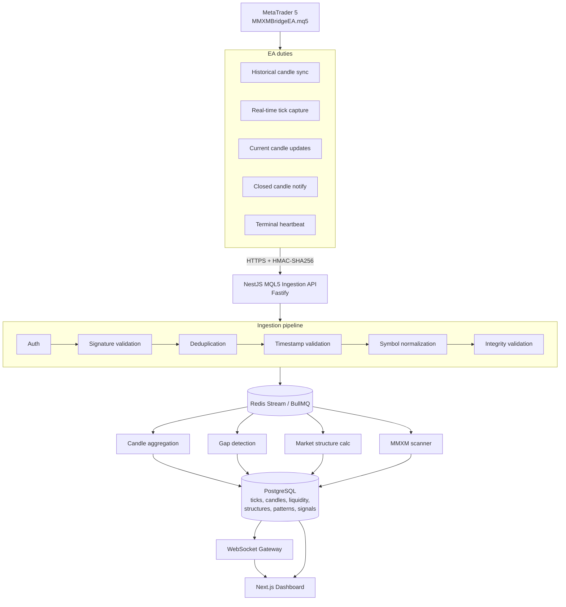
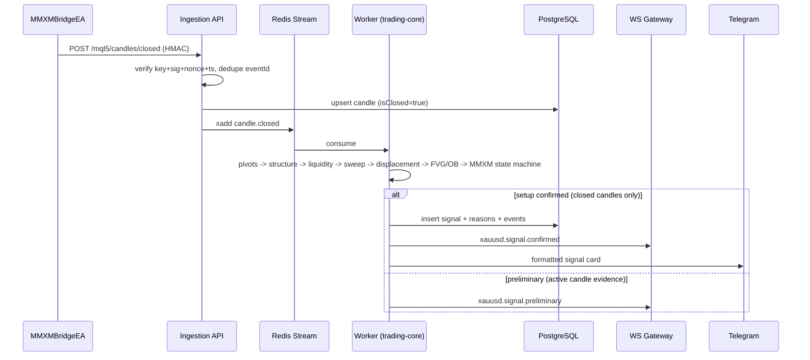

# MMXM XAUUSD Signal System — Architecture

Signal-only system. Never sends trade orders.
Defaults: `TRADING_EXECUTION_ENABLED=false`, `SIGNAL_ONLY_MODE=true`.

## System Diagram

## Component Responsibilities

| Component | Tech | Responsibility |
|---|---|---|
| MMXMBridgeEA | MQL5 | Data extraction only. No trading. Spool + retry. |
| apps/api | NestJS 11 + Fastify + Prisma + Zod | Ingestion, REST, WS gateway, Swagger |
| apps/worker | BullMQ consumer | Aggregation, gap detection, MMXM scan, signal lifecycle |
| apps/web | Next.js 15 App Router | Dashboard, chart, admin, backtests |
| packages/trading-core | Pure TS, zero deps on infra | MMXM engine (testable, deterministic) |
| packages/database | Prisma schema + client | Single source of DB truth |
| packages/types | Shared TS contracts | Payload + domain types (MQL5 <-> API <-> Web) |
| packages/market-data | TS | Candle store, session calendars, symbol mapping |
| packages/notification | TS | Telegram, Discord, Email, Webhook, in-app |

## Data Flow (signal path)

## Anti-Repaint Rules (enforced in worker + engine)

- `CONFIRMED` requires all evidence candles `isClosed = true`.
- MQL5 shift-0 candle never used as confirmation.
- Active candles only allowed for `WATCHING` / `PRELIMINARY`.
- Confirmed signal: `reasons` + initial levels immutable; status changes are new `signal_events` rows.
- Pivots locked only after `pivotRightBars` closed.
- Every rule verdict stores evidence candle IDs.

## Terminal Health

| Status | Rule |
|---|---|
| ONLINE | heartbeat < 15s |
| DEGRADED | 15-30s, or backlog high |
| OFFLINE | no heartbeat > 30s |

## Security

- Ingestion: `X-MMXM-API-KEY`, `X-MMXM-TIMESTAMP`, `X-MMXM-NONCE`, `X-MMXM-SIGNATURE`, `X-MMXM-TERMINAL-ID`.
- Signature: `HMAC-SHA256(apiSecret, timestamp + "." + nonce + "." + rawBody)`.
- Timestamp skew max 30s. Nonce single-use (Redis SETNX, TTL 60s).
- Secrets never logged (Pino redact paths).
- Web dashboard: session auth (NextAuth credentials, argon2 hash).
