# Database ERD (Prisma models -> PostgreSQL)

```mermaid
erDiagram
    mql5_terminals ||--o{ mql5_connections : has
    mql5_terminals ||--o{ mql5_heartbeats : sends
    mql5_terminals ||--o{ ticks : produces
    mql5_terminals ||--o{ candles : produces
    candles ||--o{ candle_revisions : has
    symbol_mappings ||--o{ mql5_terminals : maps
    strategy_definitions ||--o{ strategy_versions : versions
    strategy_versions ||--o{ signals : generates
    strategy_versions ||--o{ backtests : runs
    signals ||--o{ signal_reasons : has
    signals ||--o{ signal_events : lifecycle
    backtests ||--o{ backtest_trades : contains
    liquidity_levels ||--o{ signal_reasons : evidence
    mmxm_patterns ||--o{ mmxm_stage_events : stages

    mql5_terminals {
        uuid id PK
        string terminal_id UK
        string terminal_name
        int terminal_build
        string broker_name
        string server_name
        string account_id_hash
        string canonical_symbol
        string broker_symbol
        jsonb symbol_metadata
        enum status "ONLINE DEGRADED OFFLINE"
        timestamptz last_heartbeat_at
        timestamptz created_at
    }
    mql5_connections {
        uuid id PK
        uuid terminal_id FK
        timestamptz connected_at
        timestamptz disconnected_at
        string ip
    }
    mql5_heartbeats {
        bigserial id PK
        uuid terminal_id FK
        boolean terminal_connected
        boolean trade_server_connected
        timestamptz last_tick_at
        int pending_tick_count
        int pending_candle_count
        int pending_spool_count
        int memory_used_mb
        timestamptz server_ts
        timestamptz received_at
    }
    symbol_mappings {
        uuid id PK
        string canonical_symbol
        string broker_symbol
        string broker_name
        int digits
        numeric point
        numeric tick_size
        numeric tick_value
        numeric contract_size
        numeric min_volume
        numeric max_volume
        numeric volume_step
    }
    ticks {
        string event_id PK "terminalId+brokerSymbol+tsMs+seq"
        uuid terminal_id FK
        string broker_symbol
        string canonical_symbol
        bigint broker_ts_ms
        timestamptz received_at
        numeric bid
        numeric ask
        numeric last
        bigint volume
        numeric volume_real
        int flags
        int spread_points
        int sequence
    }
    candles {
        uuid id PK
        uuid terminal_id FK
        string broker_symbol
        string canonical_symbol
        string timeframe "M1 M5 M15 H1 H4 D1"
        timestamptz open_time
        timestamptz close_time
        numeric open
        numeric high
        numeric low
        numeric close
        bigint tick_volume
        numeric real_volume
        int spread
        boolean is_closed
        int revision
        string source
        timestamptz received_at
    }
    candle_revisions {
        bigserial id PK
        uuid candle_id FK
        int revision
        jsonb old_ohlc
        jsonb new_ohlc
        string reason
        timestamptz created_at
    }
    data_gap_events {
        uuid id PK
        string canonical_symbol
        string timeframe
        timestamptz gap_start
        timestamptz gap_end
        int missing_bars
        timestamptz detected_at
        timestamptz resolved_at
    }
    ingestion_events {
        bigserial id PK
        string event_id
        string endpoint
        uuid terminal_id FK
        string status "ACCEPTED DUPLICATE REJECTED"
        string reject_reason
        timestamptz received_at
    }
    strategy_definitions {
        uuid id PK
        string name
        string description
    }
    strategy_versions {
        uuid id PK
        uuid strategy_id FK
        string version
        jsonb config
        boolean is_active
        timestamptz created_at
    }
    market_structures {
        uuid id PK
        string canonical_symbol
        string timeframe
        string kind "BOS CHOCH MSS"
        string direction "BULLISH BEARISH"
        numeric break_price
        uuid pivot_candle_id
        uuid break_candle_id
        timestamptz detected_at
    }
    liquidity_levels {
        uuid id PK
        string canonical_symbol
        string timeframe
        string type "PDH PDL PWH PWL ASIA_HIGH ASIA_LOW LONDON_HIGH LONDON_LOW NEW_YORK_HIGH NEW_YORK_LOW EQUAL_HIGH EQUAL_LOW SWING_HIGH SWING_LOW"
        numeric price
        string state "FRESH TOUCHED RAIDED SWEPT BROKEN INVALIDATED"
        timestamptz detected_at
        timestamptz swept_at
        timestamptz invalidated_at
    }
    fair_value_gaps {
        uuid id PK
        string canonical_symbol
        string timeframe
        string direction
        numeric low
        numeric high
        boolean mitigated
        timestamptz formed_at
        uuid[] evidence_candle_ids
    }
    order_blocks {
        uuid id PK
        string canonical_symbol
        string timeframe
        string direction
        numeric low
        numeric high
        boolean mitigated
        timestamptz formed_at
        uuid[] evidence_candle_ids
    }
    mmxm_patterns {
        uuid id PK
        string canonical_symbol
        string model "MMBM MMSM"
        string stage
        string status
        timestamptz started_at
        timestamptz updated_at
    }
    mmxm_stage_events {
        uuid id PK
        uuid pattern_id FK
        string stage
        jsonb evidence
        timestamptz detected_at
    }
    signals {
        uuid id PK
        string canonical_symbol
        string direction "LONG SHORT"
        string status "WATCHING PRELIMINARY CONFIRMED ACTIVE INVALIDATED EXPIRED TP1_HIT TP2_HIT COMPLETED STOPPED"
        string mmxm_model
        numeric entry_min
        numeric entry_max
        numeric preferred_entry
        numeric stop_loss
        jsonb take_profits
        numeric risk_reward
        int confidence
        string htf_bias
        string setup_tf
        string confirmation_tf
        string precision_tf
        jsonb invalidation_rules
        uuid strategy_version_id FK
        timestamptz detected_at
        timestamptz confirmed_at
        timestamptz expires_at
    }
    signal_reasons {
        uuid id PK
        uuid signal_id FK
        string code
        string description
        uuid[] evidence_candle_ids
        numeric weight
    }
    signal_events {
        uuid id PK
        uuid signal_id FK
        string from_status
        string to_status
        jsonb payload
        timestamptz created_at
    }
    notifications {
        uuid id PK
        uuid signal_id FK
        string channel "TELEGRAM DISCORD EMAIL BROWSER IN_APP WEBHOOK"
        string status
        text body
        timestamptz sent_at
    }
    backtests {
        uuid id PK
        uuid strategy_version_id FK
        string canonical_symbol
        timestamptz from_ts
        timestamptz to_ts
        jsonb params "spread slippage"
        jsonb summary "trades winrate pf maxdd"
        string status
        timestamptz created_at
    }
    backtest_trades {
        uuid id PK
        uuid backtest_id FK
        string direction
        numeric entry_price
        numeric exit_price
        numeric pnl
        string exit_reason
        jsonb rule_evidence
        timestamptz entered_at
        timestamptz exited_at
    }
    audit_logs {
        bigserial id PK
        string actor
        string action
        jsonb detail
        timestamptz created_at
    }
```



## Indexes

```sql
CREATE UNIQUE INDEX candles_unique ON candles (terminal_id, broker_symbol, timeframe, open_time);
CREATE INDEX ticks_terminal_ts ON ticks (terminal_id, broker_ts_ms);
CREATE INDEX signals_lookup ON signals (canonical_symbol, status, detected_at DESC);
CREATE INDEX liquidity_lookup ON liquidity_levels (canonical_symbol, timeframe, type, detected_at DESC);
CREATE INDEX heartbeats_terminal ON mql5_heartbeats (terminal_id, received_at DESC);
```

## Retention (configurable)

| Table | Retention |
|---|---|
| ticks | 30 days (partition by month when volume grows) |
| candles M1 | permanent |
| candles M5-D1 | permanent |
| signals + events | permanent |
| audit_logs | >= 1 year |
